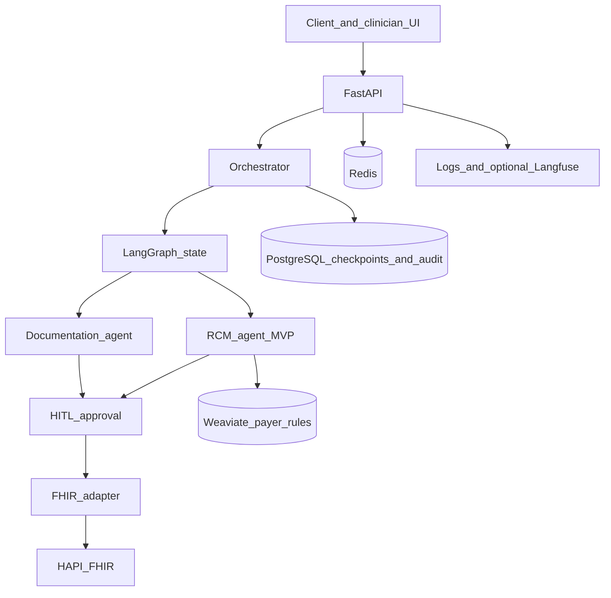

# HealthOS — Multi-Agent Healthcare AI Platform

A reference implementation of a durable, human-supervised healthcare agent architecture built with LangGraph, FastAPI, PostgreSQL and FHIR.

**Status: Early MVP / technical validation project.**

HealthOS is an engineering demonstration. It uses synthetic and test healthcare data only. It is not production clinical software, not a medical device, and not intended for autonomous diagnosis, treatment, or unsupervised clinical decision-making. It has not been formally HIPAA certified, has not been production validated, and has not been benchmarked at production scale.

Clinical recommendations in this system are drafts for a human reviewer. FHIR write-back of a note happens only after an authenticated approval.

All included patient and clinical examples are synthetic and are provided solely for development and demonstration.

## Overview

HealthOS coordinates specialist workflows through a typed LangGraph state, a FastAPI API, and a local FHIR server. The implemented path is a clinical documentation workflow: accept a transcript, de-identify it before an external model call, draft a SOAP note, score confidence, pause for review when needed, and write an approved `DocumentReference` to HAPI FHIR.

A revenue-cycle coding audit path is also implemented as an MVP pipeline. It is a heuristic and optional-LLM prototype, not a validated coding product. See [RCM functionality](#rcm-functionality).

## What HealthOS demonstrates

- Multi-agent orchestration with an explicit LangGraph
- Typed shared state, including tenant, task, confidence, and model metadata
- PostgreSQL-backed checkpointing, with an in-memory backend for tests
- Pause and resume through a human-in-the-loop gate
- Retry with backoff and a configured fallback model
- Per-task token budget handling
- FastAPI APIs with JWT auth and tenant-scoped queries
- Structured SOAP generation, quality checks, and clinician approval
- A pluggable FHIR adapter aimed at compatible EHR systems
- Append-only audit records
- Synthetic local demo data
- Optional Langfuse tracing
- Pytest, Black, and Flake8 in GitHub Actions
- Docker Compose for PostgreSQL, Redis, Weaviate, and HAPI FHIR

## Architecture



A static diagram is in [docs/architecture/healthos_architecture_v4.svg](docs/architecture/healthos_architecture_v4.svg). The prior-auth box on that diagram is a roadmap item. The running code does not include a prior-auth agent. More detail: [docs/ARCHITECTURE.md](docs/ARCHITECTURE.md).

## Implemented MVP capabilities

| Area | What the code does today |
| --- | --- |
| API | FastAPI app with health, auth, tasks, notes, documentation, RCM, and FHIR proxy routes |
| Orchestrator | Routes `task_type` to documentation or RCM, checkpoints state, enforces a step limit and routing-loop guard |
| Documentation | Transcript or optional local Whisper audio, PHI placeholder de-identification, SOAP / discharge / referral drafts, confidence and section flags |
| Review | SOAP review UI, edit, approve, then `DocumentReference` write-back |
| RCM | Coding-audit task, offline heuristic codes, optional model JSON, lexical attributions, synthetic payer-rule lookup, pre-bill checks, denial-risk score, claim row |
| Auth | JWT access and refresh tokens, bcrypt passwords, role checks, tenant id on principal |
| Data | Async SQLAlchemy models and Alembic migrations for users, patients, encounters, tasks, notes, claims, agent logs, audit trail |

## Orchestrator

The graph is `START → route_task → run_specialist → maybe_hitl → human_gate → END`.

`OrchestratorState` carries `task_id`, `task_type`, `tenant_id`, `patient_id`, `encounter_id`, `status`, `agent_outputs`, `hitl_required`, `confidence_scores`, `model_versions`, token counters, and routing-loop fields.

Routing maps a task type to the documentation or RCM specialist. Repeated identical routes and a step ceiling fail the task instead of spinning.

Transient HTTP errors to the model provider are retried with exponential jitter. If the primary model is exhausted, the node calls the configured fallback model. If the token counter is already at the task budget, the primary call is skipped in favour of the fallback model.

Checkpoints use Postgres when `HEALTHOS_ORCHESTRATOR_CHECKPOINTER=postgres`. Tests and machines without that database use `memory`. Memory checkpoints do not survive a process restart.

## Clinical Documentation Agent

`POST /tasks/document` starts a documentation task from a transcript or an uploaded audio file.

The specialist then:

1. Transcribes audio only when Whisper is installed and not skipped. Transcript-only intake is the supported demo path.
2. Replaces detected PHI-like spans with placeholders before an external completion call, then relinks values into the draft.
3. Asks the configured model for SOAP, discharge, or referral JSON. With no API key, tests use the deterministic stub path.
4. Validates structure and combines a confidence score. Low confidence sets `hitl_required`.
5. Stores a draft `Note` with model id, confidence, flagged sections, token count, and latency.

Approval is a separate authenticated call, `POST /notes/{id}/approve`. That call is what writes the FHIR `DocumentReference`. The UI can show section edits before that approval.

## RCM functionality

**Implemented in this repository**

- An orchestrated RCM audit task that requires clinical note text
- ICD-10 and CPT suggestions from a small offline keyword stub, labelled `heuristic_stub`
- An optional OpenRouter JSON path when an API key and model id are configured
- Phrase attributions from a leave-one-out lexical score. The JSON field is named like a SHAP value so a later model explainer can keep the same shape. It is not TreeSHAP or DeepSHAP, and ClinicalBERT is not bundled or invoked
- Payer-rule lookup against Weaviate when the client is up, with an in-memory synthetic fallback
- A starter set of synthetic LCD-shaped rows for retrieval tests. These are not an official payer policy database
- Code validation, a pre-bill checklist, a denial-risk score, and a `Claim` snapshot when an encounter exists
- Review and analytics screens over data stored for the signed-in tenant

**Not implemented, or not validated**

- A trained ClinicalBERT ranker or any claim that coding accuracy was measured
- A maintained library of real LCD policies
- A prior-auth agent. The prior-auth screen is a demo Kanban board and says so in the API response
- Payment posting, claim submission to a payer, or denial-recovery operations
- Any measured effect on denial rates or revenue

## Durable execution

LangGraph checkpoints store orchestrator state. With the Postgres backend, a task can be resumed after the API process restarts, including after a human-in-the-loop interrupt. The approve route resumes the graph. Redis is used for sessions, optional Celery, and the demo prior-auth board. It is not the source of truth for clinical state.

## Human-in-the-loop design

Low-confidence documentation and other gated specialist results set `hitl_required`. The graph interrupts at `human_gate` until `POST /tasks/{id}/approve`.

The SOAP UI lets a signed-in clinician edit sections, then approve the note. Approval is also required before FHIR write-back. Overrides and task actions are written to the audit trail with actor, timestamp, and metadata. Confidence thresholds are a control in this demo, not a clinical safety certification.

## FHIR integration

HealthOS uses a pluggable FHIR adapter layer designed to support integration with compatible EHR systems. Local development targets HAPI FHIR R4 at `http://localhost:8082/fhir`.

The API can read and write Patient, Encounter, Condition, Observation, MedicationRequest, ServiceRequest, and DocumentReference resources, and can mirror a Patient or Encounter into Postgres. `POST /integrations/fhir/adapters/example-ehr/demo-bundle` loads one synthetic example bundle. That bundle is not a vendor integration.

SMART on FHIR client settings exist as optional environment variables. They are not a completed embedded-EHR launch.

## Multi-tenancy

Users, tasks, encounters, notes, and claims carry a `tenant_id`. Request handlers scope queries to the authenticated principal's tenant. The local demo seed uses one fixed tenant UUID so the clinician and admin users share the same synthetic chart. That is a development convenience, not a proof of production isolation under hostile tenants.

## Auditability

`audit_trail` is append-only at the application layer. Orchestrator routing, specialist outputs, and human approvals append events that include action name, task id, tenant id, and metadata such as model version, confidence, and input hash where the specialist recorded them. The compliance screen filters and exports that table for the current tenant. Export is an engineering aid. It is not a compliance report and it is not a certification artifact.

## Technology stack

| Concern | Choice in this repo |
| --- | --- |
| API | FastAPI, Pydantic v2 |
| Orchestration | LangGraph |
| Models | OpenAI-compatible HTTP via OpenRouter. Model ids come from the environment |
| Database | PostgreSQL 16, SQLAlchemy 2 async, Alembic, asyncpg |
| Checkpoints | `langgraph-checkpoint-postgres`, or memory in tests |
| Cache, sessions, optional queue | Redis 7, optional Celery |
| Vector search | Weaviate, used for synthetic payer-rule chunks |
| FHIR | HAPI FHIR R4 and `fhir.resources` |
| Speech | Optional `openai-whisper` installed by you. Not in the default requirements, because it pulls in a large ML stack |
| Observability | Structured logging. Langfuse when you start the optional Compose overlay and set keys |
| Containers | Docker Compose for infrastructure. The API runs on the host with Uvicorn |
| CI | GitHub Actions: Black, Flake8, pytest, and a pattern check for private keys and removed demo passwords |

Prometheus and Grafana are not part of this Compose stack. spaCy, scispaCy, and ClinicalBERT weights are not dependencies of this repository. Do not download or redistribute model weights unless that model's licence allows it. Point local Whisper and any future clinical model at the official upstream distribution.

## Repository structure

```text
api/            FastAPI app, auth, orchestrator graph, FHIR, services
db/             SQLAlchemy models and enums
alembic/        Schema migrations
ui/             Clinician and operator pages served by the API
scripts/        Local demo user seed, HAPI seed, startup helper
tests/          Unit tests and optional Redis checks
infra/          Docker Compose for Postgres, Redis, Weaviate, HAPI, optional Langfuse
docs/           Architecture, local development, security notes
.github/        CI workflow
```

## Running locally

Prerequisites: Docker, Python 3.11+, and an OpenRouter API key if you want live SOAP generation. Without a key, unit tests still exercise the stub specialist path.

1. Copy `.env.example` to `.env`.
2. Set `SESSION_SECRET_KEY` and `JWT_SECRET_KEY` to long random values:

   ```powershell
   python -c "import secrets; print(secrets.token_hex(32))"
   ```

3. Copy `infra/.env.example` to `infra/.env` if you want Compose to read it. The checked-in defaults are local development only. Change them before any shared or deployed use.
4. Create a virtualenv and install dependencies:

   ```powershell
   python -m venv .venv
   .\.venv\Scripts\Activate.ps1
   pip install -r requirements.txt -r requirements-dev.txt
   ```

5. Start infrastructure:

   ```powershell
   docker compose --env-file infra/.env -f infra/docker-compose.yml up -d
   ```

6. Apply migrations and seed synthetic data:

   ```powershell
   alembic upgrade head
   python -m scripts.seed_users --demo
   python scripts/seed_hapi_fhir.py --base-url http://localhost:8082/fhir
   ```

7. Start the API:

   ```powershell
   uvicorn api.main:app --reload --host 127.0.0.1 --port 8000
   ```

`.\scripts\start_dev.ps1` runs those steps on Windows. It creates `.venv`, starts Compose, migrates, generates demo users, seeds HAPI, and launches Uvicorn.

`DATABASE_URL` for the host process must use `localhost` and the `postgresql+asyncpg://` driver. Compose uses the same password only inside the local Postgres container.

On Windows, `api/event_loop.py` selects a selector event loop so psycopg checkpoints can run. It is imported from `api/main.py`.

| Service | Local URL |
| --- | --- |
| API docs | http://127.0.0.1:8000/docs |
| Health | http://127.0.0.1:8000/health |
| SOAP review | http://127.0.0.1:8000/ui/soap-review/ |
| PostgreSQL | localhost:5432 |
| Redis | localhost:6379 |
| Weaviate | http://localhost:8080 |
| HAPI FHIR | http://localhost:8082/fhir |
| Langfuse overlay | http://127.0.0.1:3000 |

Langfuse is optional. Leave `LANGFUSE_PUBLIC_KEY` and `LANGFUSE_SECRET_KEY` unset unless that stack is running. See [docs/LOCAL_DEVELOPMENT.md](docs/LOCAL_DEVELOPMENT.md).

## Synthetic demo workflow

1. Start Docker infrastructure.
2. Apply database migrations.
3. Seed synthetic users with `python -m scripts.seed_users --demo`.
4. Seed synthetic HAPI patients and encounters.
5. Start FastAPI.
6. Open http://127.0.0.1:8000/ui/soap-review/ and sign in with the generated local user. The password is printed once and written to `.local-demo-credentials`, which is gitignored.
7. Choose **Load demo encounters**. That syncs `Patient/healthos-sample-patient-001` into Postgres.
8. Submit the synthetic transcript.
9. Generate a draft SOAP note.
10. Review and edit the sections.
11. Approve. The API writes a `DocumentReference` to local HAPI FHIR.

Create a local demo user with the seed command. Do not use demo credentials in production.

Confirm the written note at:

`http://localhost:8082/fhir/DocumentReference?patient=healthos-sample-patient-001`

## Testing

```powershell
pip install -r requirements.txt -r requirements-dev.txt
black --check .
flake8 .
pytest
```

CI runs the same checks and does not start Docker. Orchestrator tests force the memory checkpointer. FHIR client tests mock HTTP. Redis integration tests skip themselves when Redis is down. Live HAPI and Postgres checkpoint tests are not part of the default CI job.

## Security model

Designed with HIPAA-aligned security principles: authenticated access, tenant scoping, password hashes, de-identification before external model calls, and an audit trail. Formal compliance certification has not been performed.

Security architecture includes encryption-in-transit expectations for a real deployment, access control, and auditability concepts. This repository's Compose file publishes database ports on localhost for development and uses anonymous Weaviate access. That is acceptable only on a trusted workstation.

Details and threat boundaries: [docs/SECURITY.md](docs/SECURITY.md).

## Limitations

- Early MVP. Interfaces and behaviour will change.
- No clinical validation study and no claim of diagnostic performance.
- De-identification is a deterministic placeholder pass, not a qualified expert determination or Safe Harbor assessment.
- Model output quality depends entirely on the configured provider and model.
- Whisper, Langfuse, and Weaviate are optional. Missing them degrades features rather than blocking transcript SOAP review.
- Prior auth, tenant administration, and parts of the operator UI are demonstration screens over local state.
- Horizontal scaling is a design goal. Production scalability has not been benchmarked.
- A reliability target for a future production deployment has not been measured here.

## Project status

Early MVP / technical validation project.

The documentation workflow, orchestrator, auth, persistence, and local FHIR write-back are implemented and covered by unit tests. They are not a production rollout. RCM is an implemented prototype with explicit stub behaviour. Prior auth is not an agent.

## Roadmap

Possible later work, none of it claimed as done:

- Stronger de-identification and a documented evaluation set
- A real clinical-coding model, only if its licence allows the intended use
- Postgres-backed prior authorisation instead of the demo board
- Authenticated Weaviate and locked-down Compose for anything beyond a laptop
- Measured load tests before any statement about throughput or uptime
- A chosen open-source licence, if the copyright holder decides to grant one

## License

Copyright © Riyaz M. All rights reserved unless otherwise stated.

No permissive licence is granted by this repository. You may not copy or reuse the application code except where a file explicitly says otherwise. Dependencies remain under their own licences.

## Portfolio / engineering context

This repository is a public technical demonstration of the HealthOS design: durable orchestration, human review, and FHIR write-back on synthetic data. It is aimed at engineers reviewing architecture, not at clinicians using it for care.

This repository supersedes an earlier healthcare multi-agent architecture experiment and now contains the public portfolio implementation of HealthOS.

Model provider and model id are configuration. `OPENROUTER_MODEL_DEV`, `OPENROUTER_MODEL_PRODUCTION`, `OPENROUTER_MODEL_DEMO`, and `DOCUMENTATION_SOAP_MODEL` can point at any chat model your account can call. The checked-in examples use `meta-llama/llama-3.1-8b-instruct` only as a placeholder id.
