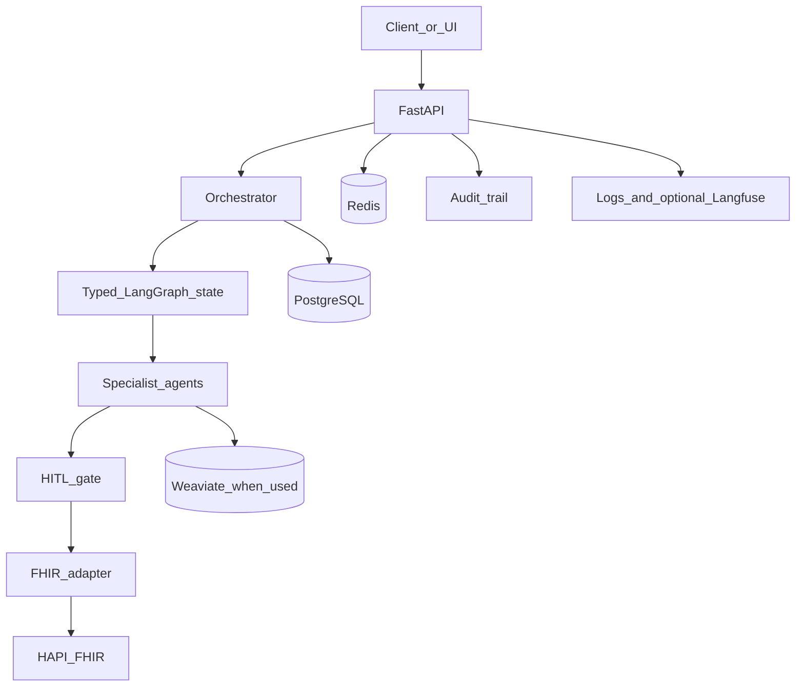

# Architecture

HealthOS is a single FastAPI process plus local infrastructure. Specialist behaviour lives in process, behind one LangGraph, rather than as separately deployed microservices. That is the implementation. A later split into services is a design option, not the current runtime.

## Request path

The browser or an API client calls FastAPI with a bearer token. Routes load the principal, check the role, and scope rows by `tenant_id`. Long work is a `Task`. The orchestrator runner builds `OrchestratorState`, compiles the graph with a checkpointer, and invokes it.

## Orchestrator

`api/graphs/orchestrator/graph.py` compiles the graph. `state.py` is the typed dict. `routing.py` maps task types. `nodes.py` implements routing safety, specialist dispatch, retries, fallback, token budget, and the human interrupt.

Documentation runs through `api/services/documentation_specialist.py`. RCM runs through `api/services/rcm_specialist.py`. Unknown task types fail closed.

## Human gate

`human_gate_node` uses a LangGraph interrupt when `hitl_required` is set. `POST /tasks/{id}/approve` resumes the checkpoint. Note approval is a second, explicit action and is the one that may write a `DocumentReference`.

## FHIR

`api/fhir/client.py` is the HTTP client. Handlers validate with `fhir.resources` and map a few R4 fields that the installed library parses strictly. `api/fhir/adapters/example_ehr.py` is a synthetic adapter example. HealthOS uses a pluggable FHIR adapter layer designed to support integration with compatible EHR systems.

## Persistence

PostgreSQL stores users, patients, encounters, tasks, notes, claims, agent logs, and the audit trail. LangGraph checkpoints use the same server when the Postgres checkpointer is selected. Redis holds session and refresh bindings, optional Celery messages, pub/sub envelopes, and the demo prior-auth board.

## Observability

Application logs are structured. If Langfuse keys and a base URL are set, model calls can emit traces. Nothing in the default Compose file scrapes Prometheus metrics.

## What the diagram's deferred boxes mean

The architecture SVG labels a prior-auth agent as post-MVP. The UI board under `ui/prior-auth/` stores demo cards. It does not submit authorisations anywhere.
